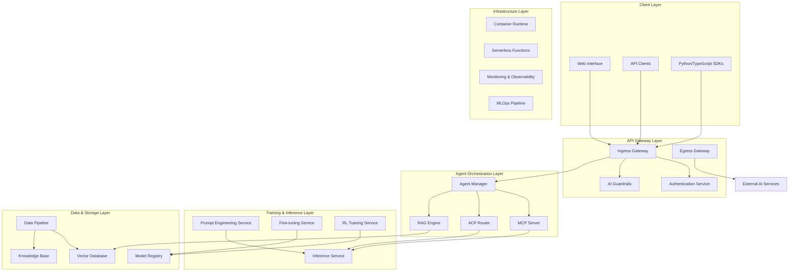
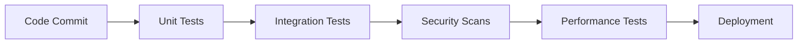

# AI Agent Framework Design Document

## Overview

The AI Agent Framework is a comprehensive platform that integrates advanced LLM training methodologies, sophisticated orchestration capabilities, and scalable deployment infrastructure. The system follows a microservices architecture with clear separation of concerns, enabling organizations to build, train, deploy, and manage intelligent AI agents at scale.

The framework adopts a hybrid approach to LLM specialization, combining the agility of prompt engineering with the precision of fine-tuning. It leverages LangChain's orchestration protocols (MCP, ACP, RAG) for advanced agent capabilities and implements a multi-layered security model with AI-specific guardrails.

## Architecture

### High-Level Architecture



### Core Components Architecture

The system is built around several key architectural patterns:

1. **Microservices Architecture**: Each major component (training, inference, orchestration) is deployed as an independent service
2. **Event-Driven Architecture**: Components communicate through events and message queues for loose coupling
3. **API-First Design**: All services expose well-defined REST APIs with OpenAPI specifications
4. **Multi-Tenant Architecture**: Support for multiple organizations with isolated resources and data

## Components and Interfaces

### 1. Training Infrastructure

#### Prompt Engineering Service
- **Purpose**: Manages prompt templates, in-context learning examples, and dynamic prompt optimization
- **Key Interfaces**:
  - `POST /prompts/templates` - Create and manage prompt templates
  - `POST /prompts/optimize` - Optimize prompts using A/B testing
  - `GET /prompts/evaluate` - Evaluate prompt performance metrics
- **Technologies**: FastAPI, Redis for caching, PostgreSQL for template storage

#### Fine-tuning Service
- **Purpose**: Orchestrates supervised fine-tuning and PEFT methods (LoRA, adapters)
- **Key Interfaces**:
  - `POST /finetune/jobs` - Submit fine-tuning jobs
  - `GET /finetune/jobs/{id}/status` - Monitor training progress
  - `POST /finetune/peft` - Configure PEFT parameters
- **Technologies**: PyTorch, Transformers, Ray for distributed training

#### RL Training Service
- **Purpose**: Implements reinforcement learning using LlamaGym and LOOP algorithms
- **Key Interfaces**:
  - `POST /rl/environments` - Define training environments
  - `POST /rl/agents` - Create and configure RL agents
  - `GET /rl/training/{id}/metrics` - Track learning progress
- **Technologies**: LlamaGym, Gymnasium, PPO implementation

### 2. Orchestration Layer

#### MCP Server
- **Purpose**: Provides standardized tool access following Model Context Protocol
- **Key Interfaces**:
  - `GET /mcp/tools` - Discover available tools
  - `POST /mcp/tools/{id}/invoke` - Execute tool functions
  - `WebSocket /mcp/stream` - Real-time tool interactions
- **Technologies**: FastAPI with WebSocket support, asyncio

#### ACP Router
- **Purpose**: Enables agent-to-agent communication using Agent Communication Protocol
- **Key Interfaces**:
  - `POST /acp/runs` - Execute agent runs
  - `GET /acp/threads/{id}` - Manage multi-turn conversations
  - `POST /acp/store` - Access long-term memory
- **Technologies**: FastAPI, Redis for session management, PostgreSQL for persistent storage

#### RAG Engine
- **Purpose**: Implements retrieval-augmented generation with advanced chunking and reranking
- **Key Interfaces**:
  - `POST /rag/index` - Index documents and create embeddings
  - `POST /rag/query` - Perform semantic search and retrieval
  - `POST /rag/rerank` - Apply reranking algorithms
- **Technologies**: LangChain, sentence-transformers, Pinecone/Weaviate

### 3. Security and Compliance

#### Authentication Service
- **Purpose**: Centralized authentication and authorization using OAuth 2.0, JWT, and RBAC
- **Key Interfaces**:
  - `POST /auth/login` - User authentication
  - `POST /auth/tokens/refresh` - Token refresh
  - `GET /auth/permissions` - Check user permissions
- **Technologies**: FastAPI, Auth0/Keycloak, Redis for session storage

#### AI Guardrails Service
- **Purpose**: Content moderation, bias detection, and ethical safeguards
- **Key Interfaces**:
  - `POST /guardrails/content/moderate` - Content filtering
  - `POST /guardrails/bias/detect` - Bias analysis
  - `POST /guardrails/validate` - Response validation
- **Technologies**: Transformers for bias detection, custom content filters

### 4. Data Management

#### Data Pipeline Service
- **Purpose**: ETL processes for data ingestion, cleaning, and preparation
- **Key Interfaces**:
  - `POST /data/ingest` - Ingest raw data
  - `POST /data/clean` - Apply cleaning transformations
  - `POST /data/synthetic/generate` - Generate synthetic data
- **Technologies**: Apache Airflow, Pandas, Faker for synthetic data

#### Vector Database
- **Purpose**: High-performance vector storage and similarity search
- **Implementation**: Pinecone (managed) or Weaviate (self-hosted)
- **Features**: Hybrid search, metadata filtering, real-time indexing

## Data Models

### Core Entities

```python
# Agent Configuration
class AgentConfig(BaseModel):
    id: str
    name: str
    type: AgentType  # PROMPT_BASED, FINE_TUNED, RL_TRAINED
    model_id: str
    capabilities: List[str]
    tools: List[str]
    memory_config: MemoryConfig
    
# Training Job
class TrainingJob(BaseModel):
    id: str
    type: TrainingType  # PROMPT_ENGINEERING, FINE_TUNING, RL_TRAINING
    status: JobStatus
    config: TrainingConfig
    metrics: Dict[str, float]
    created_at: datetime
    
# Tool Definition (MCP)
class Tool(BaseModel):
    id: str
    name: str
    description: str
    parameters: Dict[str, Any]
    endpoint: str
    auth_required: bool
    
# Conversation Thread (ACP)
class Thread(BaseModel):
    id: str
    participants: List[str]
    messages: List[Message]
    context: Dict[str, Any]
    created_at: datetime
```

### Data Flow Patterns

1. **Training Data Flow**: Raw Data → Cleaning → Annotation → Augmentation → Training
2. **Inference Data Flow**: User Input → Guardrails → Agent Processing → Response Validation → Output
3. **Knowledge Flow**: Documents → Chunking → Embedding → Vector Storage → Retrieval

## Error Handling

### Error Categories and Strategies

1. **Training Errors**
   - Data quality issues: Validation and cleaning pipelines
   - Model convergence failures: Hyperparameter optimization and early stopping
   - Resource constraints: Dynamic scaling and queue management

2. **Inference Errors**
   - Model unavailability: Circuit breakers and fallback models
   - Rate limiting: Intelligent queuing and priority handling
   - Malformed responses: Output parsing with retry mechanisms

3. **Security Errors**
   - Authentication failures: Secure token refresh and session management
   - Guardrail violations: Content blocking and audit logging
   - Data privacy breaches: Encryption and access controls

### Error Response Format

```json
{
  "error": {
    "code": "TRAINING_CONVERGENCE_FAILED",
    "message": "Model failed to converge after 100 epochs",
    "details": {
      "job_id": "train_123",
      "epoch": 100,
      "loss": 0.95,
      "suggested_action": "Adjust learning rate or increase epochs"
    },
    "timestamp": "2025-01-14T10:30:00Z"
  }
}
```

## Testing Strategy

### Testing Pyramid

1. **Unit Tests (70%)**
   - Individual service components
   - Data transformation functions
   - Model inference logic
   - Authentication and authorization

2. **Integration Tests (20%)**
   - Service-to-service communication
   - Database interactions
   - External API integrations
   - End-to-end agent workflows

3. **System Tests (10%)**
   - Performance and load testing
   - Security penetration testing
   - Disaster recovery scenarios
   - Multi-tenant isolation

### Testing Tools and Frameworks

- **Unit Testing**: pytest, unittest.mock
- **Integration Testing**: testcontainers, Docker Compose
- **Load Testing**: Locust, Apache JMeter
- **Security Testing**: OWASP ZAP, Bandit
- **AI Model Testing**: Great Expectations, Evidently AI

### Continuous Testing Pipeline



## Performance Considerations

### Scalability Patterns

1. **Horizontal Scaling**
   - Stateless service design
   - Load balancing with session affinity
   - Database sharding and read replicas

2. **Caching Strategies**
   - Semantic caching for similar queries
   - Model output caching with TTL
   - Embedding cache for frequent retrievals

3. **Asynchronous Processing**
   - Message queues for long-running tasks
   - WebSocket connections for real-time updates
   - Background job processing with Celery

### Performance Optimization

1. **Model Optimization**
   - Model quantization and pruning
   - ONNX runtime for faster inference
   - Batch processing for multiple requests

2. **Infrastructure Optimization**
   - GPU utilization monitoring
   - Auto-scaling based on queue depth
   - CDN for static assets and model artifacts

3. **Database Optimization**
   - Connection pooling
   - Query optimization and indexing
   - Materialized views for analytics

## Security Architecture

### Defense in Depth

1. **Network Security**
   - VPC with private subnets
   - WAF for application protection
   - DDoS protection and rate limiting

2. **Application Security**
   - Input validation and sanitization
   - SQL injection prevention
   - Cross-site scripting (XSS) protection

3. **Data Security**
   - Encryption at rest (AES-256)
   - Encryption in transit (TLS 1.3)
   - Key management with HSM/KMS

4. **AI-Specific Security**
   - Prompt injection detection
   - Model extraction protection
   - Adversarial input filtering

### Compliance Framework

1. **GDPR Compliance**
   - Data subject rights implementation
   - Privacy by design principles
   - Data processing audit trails

2. **HIPAA Compliance** (if applicable)
   - PHI encryption and access controls
   - Audit logging and monitoring
   - Business associate agreements

3. **AI Ethics Compliance**
   - Bias monitoring and mitigation
   - Explainability and transparency
   - Human oversight mechanisms

This design provides a robust, scalable, and secure foundation for implementing the comprehensive AI agent framework described in the requirements.