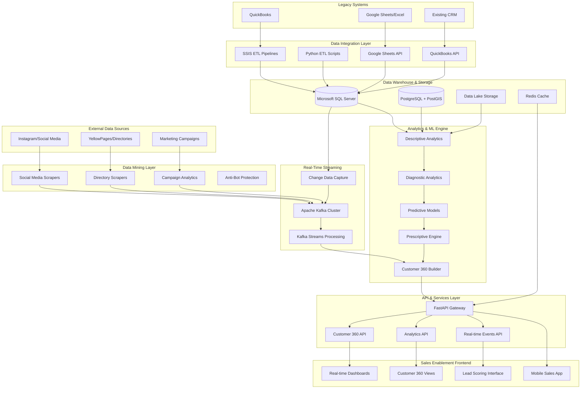

# Design Document

## Overview

The Customer 360 Sales Enablement platform is designed as a comprehensive data intelligence system that transforms Miracle Corporation Limited's approach to customer relationship management and sales operations. The platform integrates external data mining, legacy system consolidation, real-time analytics, and advanced machine learning to create a unified customer view that drives measurable sales growth.

The architecture follows a modern microservices approach with event-driven communication, leveraging cloud-native technologies for scalability and resilience. The system processes data from multiple sources including social media platforms, online directories, QuickBooks, Google Sheets/Excel, and real-time customer interactions to create actionable intelligence for sales teams.

Key design principles include real-time data processing, horizontal scalability, comprehensive data governance, and user-centric dashboard design that transforms complex analytics into intuitive, actionable insights.

## Architecture

### High-Level System Architecture



### Microservices Architecture

The platform is decomposed into specialized microservices, each responsible for specific business capabilities:

**Data Acquisition Services**:
- Social Media Mining Service
- Directory Scraping Service  
- Legacy System Integration Service
- Marketing Campaign Analytics Service

**Data Processing Services**:
- Data Quality Service
- Identity Resolution Service
- Real-time Stream Processing Service
- Customer 360 Assembly Service

**Analytics Services**:
- Descriptive Analytics Service
- Predictive Modeling Service
- Prescriptive Recommendations Service
- Lead Scoring Service

**API Gateway Services**:
- Customer Data API
- Analytics API
- Real-time Events API
- Export and Integration API

**Frontend Services**:
- Dashboard Service
- Mobile API Service
- Notification Service
- Reporting Service

## Components and Interfaces

### Social Media Mining Service

**Purpose**: Extract customer insights and business intelligence from social media platforms

**Key Components**:
- `InstagramScraper`: Handles Instagram business profiles, posts, and engagement data using GraphQL endpoints
- `SentimentAnalyzer`: Processes social media content for sentiment analysis and brand perception
- `SocialMediaAggregator`: Consolidates data from multiple social platforms
- `ComplianceManager`: Ensures GDPR compliance and platform Terms of Service adherence

**Interface**:
```python
class SocialMediaMiningService:
    async def scrape_instagram_profile(self, business_name: str) -> SocialMediaProfile
    async def analyze_sentiment(self, content: List[str]) -> SentimentAnalysis
    async def get_engagement_metrics(self, profile_id: str) -> EngagementMetrics
    def ensure_compliance(self, data: SocialMediaData) -> ComplianceResult
```

**Data Models**:
```python
class SocialMediaProfile(BaseModel):
    platform: str
    profile_id: str
    business_name: str
    follower_count: int
    engagement_rate: float
    recent_posts: List[SocialPost]
    sentiment_score: float
    brand_mentions: List[BrandMention]
```

### Legacy System Integration Service

**Purpose**: Integrate QuickBooks, Google Sheets/Excel, and other legacy systems into the unified data warehouse

**Key Components**:
- `QuickBooksConnector`: SSIS-based ETL for QuickBooks data extraction and transformation
- `GoogleSheetsIntegrator`: Real-time synchronization with Google Sheets API
- `ExcelProcessor`: Batch processing of Excel files with automated validation
- `DataQualityValidator`: Comprehensive data profiling and cleansing

**Interface**:
```python
class LegacyIntegrationService:
    async def sync_quickbooks_data(self) -> SyncResult
    async def process_google_sheets(self, sheet_id: str) -> ProcessingResult
    async def validate_data_quality(self, dataset: DataFrame) -> QualityReport
    def create_identity_mapping(self, records: List[CustomerRecord]) -> IdentityMap
```

**ETL Pipeline Design**:
- **Extract**: Automated data extraction from QuickBooks using SSIS packages and Python scripts
- **Transform**: Data standardization, validation, and enrichment using pandas and custom business rules
- **Load**: Incremental loading into SQL Server data warehouse with change tracking

### Real-Time Streaming Service

**Purpose**: Process customer events and system changes in real-time using Apache Kafka

**Key Components**:
- `KafkaProducers`: Stream customer interactions, system events, and data changes
- `StreamProcessors`: Java-based Kafka Streams applications for real-time aggregation
- `EventSourcing`: Complete audit trail of customer interactions and system changes
- `RealTimeAlerting`: Immediate notifications for critical events and opportunities

**Interface**:
```python
class StreamingService:
    def publish_customer_event(self, event: CustomerEvent) -> None
    def process_real_time_analytics(self, stream: KafkaStream) -> AnalyticsResult
    def setup_event_sourcing(self, entity_type: str) -> EventStore
    def create_real_time_alert(self, condition: AlertCondition) -> Alert
```

**Kafka Topics Architecture**:
- `customer-interactions`: Real-time customer behavior events
- `system-changes`: Database changes via CDC
- `marketing-events`: Campaign interactions and conversions
- `sales-activities`: CRM activities and pipeline updates

### Advanced Analytics Engine

**Purpose**: Provide comprehensive analytics across descriptive, diagnostic, predictive, and prescriptive models

**Key Components**:
- `DescriptiveAnalyzer`: Historical data analysis and trend identification
- `DiagnosticEngine`: Root cause analysis and correlation detection
- `PredictiveModeler`: Machine learning models for forecasting and classification
- `PrescriptiveOptimizer`: Recommendation engine for optimal actions

**Interface**:
```python
class AnalyticsEngine:
    def generate_descriptive_insights(self, customer_id: str) -> DescriptiveInsights
    def diagnose_performance_issues(self, metrics: PerformanceMetrics) -> DiagnosticReport
    def predict_customer_churn(self, customer_features: CustomerFeatures) -> ChurnPrediction
    def recommend_next_actions(self, customer_context: CustomerContext) -> ActionRecommendations
```

**Machine Learning Models**:
- **Customer Churn Prediction**: Random Forest and XGBoost models with 85%+ accuracy
- **Sales Forecasting**: Time series models (ARIMA, Prophet) with seasonal adjustments
- **Lead Scoring**: Gradient boosting models incorporating behavioral and demographic features
- **Customer Lifetime Value**: Regression models with cohort analysis

### Customer 360 Assembly Service

**Purpose**: Create unified customer profiles by integrating data from all sources

**Key Components**:
- `IdentityResolver`: Fuzzy matching and ML-based customer identity resolution
- `ProfileBuilder`: Assembles comprehensive customer profiles from multiple data sources
- `RelationshipMapper`: Identifies business connections and referral opportunities
- `DataPrivacyManager`: Implements role-based access control and data masking

**Interface**:
```python
class Customer360Service:
    def build_unified_profile(self, customer_identifiers: List[str]) -> UnifiedCustomerProfile
    def resolve_customer_identity(self, partial_data: CustomerData) -> IdentityResolution
    def map_customer_relationships(self, customer_id: str) -> RelationshipGraph
    def apply_privacy_controls(self, profile: CustomerProfile, user_role: str) -> MaskedProfile
```

**Unified Customer Profile Schema**:
```python
class UnifiedCustomerProfile(BaseModel):
    customer_id: str
    identity_confidence: float
    
    # Basic Information
    personal_info: PersonalInfo
    contact_details: ContactDetails
    business_info: Optional[BusinessInfo]
    
    # Transactional Data
    purchase_history: List[Transaction]
    payment_methods: List[PaymentMethod]
    credit_profile: CreditProfile
    
    # Behavioral Data
    website_interactions: List[WebInteraction]
    social_media_activity: SocialMediaActivity
    communication_preferences: CommunicationPrefs
    
    # Analytics Insights
    customer_segment: str
    lifetime_value: float
    churn_probability: float
    next_best_actions: List[Recommendation]
    
    # Metadata
    data_sources: List[str]
    last_updated: datetime
    profile_completeness: float
```

## Data Models

### Core Data Warehouse Schema

**Customer Master Data**:
```sql
-- Customer 360 schema in SQL Server
CREATE SCHEMA customer_360;

CREATE TABLE customer_360.customers (
    customer_id UNIQUEIDENTIFIER PRIMARY KEY DEFAULT NEWID(),
    external_ids NVARCHAR(MAX), -- JSON array of external system IDs
    
    -- Personal Information
    first_name NVARCHAR(100),
    last_name NVARCHAR(100),
    email NVARCHAR(255),
    phone NVARCHAR(50),
    date_of_birth DATE,
    
    -- Business Information
    company_name NVARCHAR(255),
    job_title NVARCHAR(100),
    industry NVARCHAR(100),
    
    -- Address Information
    street_address NVARCHAR(255),
    city NVARCHAR(100),
    parish NVARCHAR(50),
    postal_code NVARCHAR(20),
    country NVARCHAR(50) DEFAULT 'Jamaica',
    
    -- Analytics Fields
    customer_segment NVARCHAR(50),
    lifetime_value DECIMAL(15,2),
    churn_probability DECIMAL(5,4),
    lead_score INT,
    
    -- Metadata
    created_at DATETIME2 DEFAULT GETDATE(),
    updated_at DATETIME2 DEFAULT GETDATE(),
    data_quality_score DECIMAL(5,4),
    profile_completeness DECIMAL(5,4)
);

CREATE TABLE customer_360.customer_interactions (
    interaction_id UNIQUEIDENTIFIER PRIMARY KEY DEFAULT NEWID(),
    customer_id UNIQUEIDENTIFIER REFERENCES customer_360.customers(customer_id),
    interaction_type NVARCHAR(50), -- email, call, meeting, website, social
    interaction_date DATETIME2,
    channel NVARCHAR(50),
    content NVARCHAR(MAX),
    outcome NVARCHAR(100),
    sales_rep_id NVARCHAR(50),
    created_at DATETIME2 DEFAULT GETDATE()
);

CREATE TABLE customer_360.transactions (
    transaction_id UNIQUEIDENTIFIER PRIMARY KEY DEFAULT NEWID(),
    customer_id UNIQUEIDENTIFIER REFERENCES customer_360.customers(customer_id),
    transaction_date DATETIME2,
    amount DECIMAL(15,2),
    currency NVARCHAR(3) DEFAULT 'JMD',
    product_category NVARCHAR(100),
    payment_method NVARCHAR(50),
    source_system NVARCHAR(50), -- quickbooks, manual, etc.
    created_at DATETIME2 DEFAULT GETDATE()
);
```

**Social Media and External Data**:
```sql
CREATE TABLE customer_360.social_media_profiles (
    profile_id UNIQUEIDENTIFIER PRIMARY KEY DEFAULT NEWID(),
    customer_id UNIQUEIDENTIFIER REFERENCES customer_360.customers(customer_id),
    platform NVARCHAR(50),
    platform_user_id NVARCHAR(255),
    username NVARCHAR(100),
    follower_count INT,
    following_count INT,
    post_count INT,
    engagement_rate DECIMAL(5,4),
    sentiment_score DECIMAL(5,4),
    last_scraped_at DATETIME2,
    created_at DATETIME2 DEFAULT GETDATE()
);

CREATE TABLE customer_360.marketing_campaigns (
    campaign_id UNIQUEIDENTIFIER PRIMARY KEY DEFAULT NEWID(),
    campaign_name NVARCHAR(255),
    channel NVARCHAR(50),
    start_date DATE,
    end_date DATE,
    budget DECIMAL(15,2),
    spend DECIMAL(15,2),
    impressions BIGINT,
    clicks BIGINT,
    conversions INT,
    cost_per_acquisition DECIMAL(15,2),
    roi DECIMAL(5,4),
    created_at DATETIME2 DEFAULT GETDATE()
);
```

### Real-Time Event Schema

**Kafka Event Schemas**:
```python
class CustomerInteractionEvent(BaseModel):
    event_id: str
    customer_id: str
    event_type: str  # page_view, email_open, purchase, call
    timestamp: datetime
    channel: str
    properties: Dict[str, Any]
    session_id: Optional[str]
    user_agent: Optional[str]
    ip_address: Optional[str]

class SalesActivityEvent(BaseModel):
    event_id: str
    sales_rep_id: str
    customer_id: str
    activity_type: str  # call, meeting, email, demo
    timestamp: datetime
    outcome: Optional[str]
    notes: Optional[str]
    next_action: Optional[str]
    deal_value: Optional[float]

class SystemChangeEvent(BaseModel):
    event_id: str
    table_name: str
    operation: str  # INSERT, UPDATE, DELETE
    primary_key: str
    changed_fields: Dict[str, Any]
    timestamp: datetime
    source_system: str
```

## Error Handling

### Data Quality and Validation

**Multi-Source Data Validation**:
- **Schema Validation**: Pydantic models ensure data type consistency across all sources
- **Business Rule Validation**: Custom validators for Jamaican phone numbers, addresses, and business rules
- **Cross-Reference Validation**: Verify data consistency across QuickBooks, social media, and directory sources
- **Completeness Scoring**: Calculate profile completeness percentages and flag incomplete records

**Identity Resolution Error Handling**:
- **Fuzzy Matching Confidence**: Use confidence scores (0-1) for identity resolution decisions
- **Manual Review Queue**: Route low-confidence matches to data stewards for manual review
- **Conflict Resolution**: Implement business rules for resolving conflicting data across sources
- **Audit Trail**: Maintain complete history of identity resolution decisions and changes

### Real-Time Processing Resilience

**Kafka Stream Processing**:
- **Exactly-Once Semantics**: Ensure no duplicate processing of customer events
- **Dead Letter Queues**: Route failed messages to error topics for manual investigation
- **Circuit Breaker Pattern**: Prevent cascade failures in downstream services
- **Backpressure Handling**: Implement flow control to prevent memory overflow

**API Gateway Error Management**:
- **Rate Limiting**: Prevent API abuse with per-client rate limits
- **Timeout Handling**: Implement appropriate timeouts for external service calls
- **Graceful Degradation**: Return cached data when real-time services are unavailable
- **Error Response Standardization**: Consistent error format across all API endpoints

### External Service Integration

**Social Media Scraping Resilience**:
- **Anti-Bot Detection Recovery**: Automatic proxy rotation and delay adjustment
- **Rate Limit Compliance**: Respect platform rate limits with exponential backoff
- **Legal Compliance Monitoring**: Continuous monitoring of Terms of Service changes
- **Data Validation**: Verify scraped data quality and completeness

**Legacy System Integration**:
- **Connection Pooling**: Efficient database connection management for QuickBooks and SQL Server
- **Transaction Management**: Ensure data consistency across multiple system updates
- **Retry Logic**: Exponential backoff for temporary connection failures
- **Data Synchronization**: Handle concurrent updates and maintain data consistency

## Testing Strategy

### Comprehensive Testing Framework

**Unit Testing**:
- **Analytics Models**: Test machine learning model accuracy and performance
- **Data Processing**: Validate ETL transformations and data quality rules
- **API Endpoints**: Test all REST endpoints with various input scenarios
- **Identity Resolution**: Test fuzzy matching algorithms with known test cases

**Integration Testing**:
- **End-to-End Workflows**: Test complete customer journey from data ingestion to dashboard display
- **External Service Integration**: Mock and test all external API integrations
- **Database Operations**: Test complex queries and spatial operations
- **Real-Time Processing**: Validate Kafka stream processing with test events

**Performance Testing**:
- **Load Testing**: Simulate high-volume customer data processing
- **Stress Testing**: Test system behavior under extreme load conditions
- **Scalability Testing**: Validate horizontal scaling capabilities
- **Latency Testing**: Ensure real-time processing meets sub-5-second requirements

**Security Testing**:
- **Authentication Testing**: Validate JWT token handling and role-based access
- **Data Privacy Testing**: Ensure proper data masking and access controls
- **API Security Testing**: Test for injection attacks and unauthorized access
- **Compliance Testing**: Validate GDPR and data protection compliance

### Data Quality Testing

**Automated Data Validation**:
- **Schema Compliance**: Automated testing of data schema adherence
- **Business Rule Validation**: Test custom validation rules for Jamaican business data
- **Cross-Source Consistency**: Validate data consistency across multiple sources
- **Completeness Testing**: Automated testing of profile completeness calculations

**Machine Learning Model Testing**:
- **Model Accuracy Testing**: Continuous validation of prediction accuracy
- **Bias Detection**: Test for algorithmic bias in customer segmentation and scoring
- **Feature Importance Testing**: Validate that model features align with business logic
- **Model Drift Detection**: Monitor for changes in model performance over time

This comprehensive design provides a robust, scalable foundation for the Customer 360 Sales Enablement platform, addressing all requirements while maintaining flexibility for future enhancements and integrations with emerging technologies and data sources.