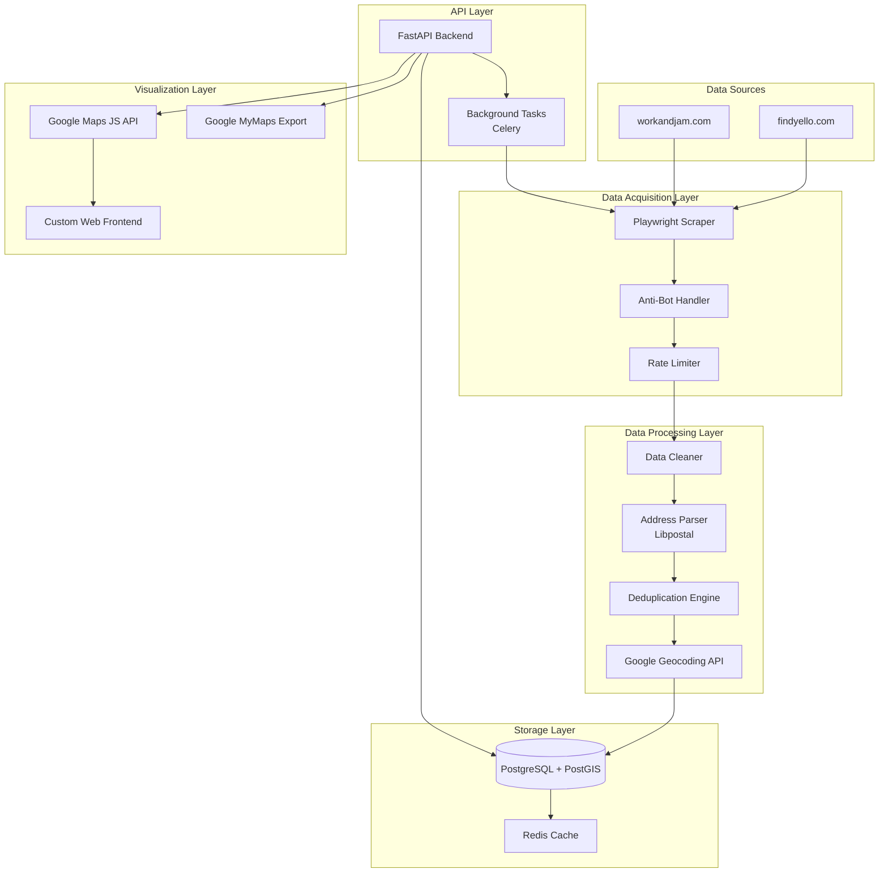

# Design Document

## Overview

The Jamaica Business Directory system is designed as a comprehensive data engineering pipeline that transforms unstructured web data into actionable geographic intelligence. The system follows a microservices architecture with clear separation of concerns across data acquisition, processing, storage, and visualization layers.

The architecture leverages modern Python technologies with FastAPI as the backbone, Playwright for robust web scraping, PostgreSQL with PostGIS for geospatial data management, and Google Maps Platform for geocoding and visualization. The system is designed for scalability, maintainability, and resilience against anti-bot measures.

## Architecture

### High-Level System Architecture



### Component Architecture

The system is organized into distinct layers with well-defined interfaces:

**Data Acquisition Layer**: Handles web scraping with Playwright, implements anti-bot countermeasures, and manages rate limiting to ensure sustainable data collection.

**Data Processing Layer**: Performs data cleaning, address standardization using Libpostal, deduplication using fuzzy matching, and geocoding via Google APIs.

**Storage Layer**: PostgreSQL with PostGIS extension for geospatial data storage, Redis for caching geocoded results and session management.

**API Layer**: FastAPI provides RESTful endpoints with automatic documentation, background task processing via Celery for long-running operations.

**Visualization Layer**: Google Maps JavaScript API for dynamic map rendering, custom web frontend for user interaction, and export capabilities for Google MyMaps integration.

## Components and Interfaces

### Web Scraping Service

**Purpose**: Extract business data from Jamaica Yellow Pages directories

**Key Components**:
- `PlaywrightScraper`: Main scraping engine with browser automation
- `AntiBot`: Handles CAPTCHA solving, proxy rotation, and human behavior simulation
- `PageNavigator`: Manages pagination and URL construction
- `DataExtractor`: Parses HTML and extracts structured business data

**Interface**:
```python
class ScrapingService:
    async def scrape_category(self, category: str, location: str) -> List[BusinessData]
    async def scrape_business_details(self, business_url: str) -> BusinessData
    def get_scraping_status(self, task_id: str) -> ScrapingStatus
```

**Configuration**:
- Configurable selectors for different website structures
- Rate limiting parameters (requests per minute, delay ranges)
- Proxy rotation settings and user agent pools
- Retry logic with exponential backoff

### Data Processing Service

**Purpose**: Clean, standardize, and deduplicate scraped business data

**Key Components**:
- `DataCleaner`: Removes invalid entries, standardizes formats
- `AddressParser`: Uses Libpostal for Jamaican address standardization
- `DeduplicationEngine`: Implements exact and fuzzy matching algorithms
- `DataValidator`: Ensures data quality and completeness

**Interface**:
```python
class DataProcessingService:
    def clean_business_data(self, raw_data: List[RawBusinessData]) -> List[CleanBusinessData]
    def parse_addresses(self, addresses: List[str]) -> List[ParsedAddress]
    def deduplicate_businesses(self, businesses: List[BusinessData]) -> List[BusinessData]
    def validate_data_quality(self, data: BusinessData) -> ValidationResult
```

**Address Standardization Rules**:
- Jamaican postal zone formatting (e.g., "KINGSTON 10")
- Street address normalization (e.g., "St." → "STREET")
- PO Box standardization
- Country code enforcement ("JAMAICA")

### Geocoding Service

**Purpose**: Convert addresses to geographic coordinates using Google Geocoding API

**Key Components**:
- `GeocodingClient`: Manages Google API interactions
- `CacheManager`: Redis-based caching for geocoded results
- `RateLimiter`: Prevents API quota exhaustion
- `ErrorHandler`: Manages API failures and retry logic

**Interface**:
```python
class GeocodingService:
    async def geocode_address(self, address: str) -> GeocodingResult
    async def batch_geocode(self, addresses: List[str]) -> List[GeocodingResult]
    def get_cached_result(self, address: str) -> Optional[GeocodingResult]
    def update_cache(self, address: str, result: GeocodingResult) -> None
```

**Cost Optimization Strategies**:
- Aggressive caching of successful geocoding results
- Pre-processing addresses to maximize success rate
- Batch processing to optimize network overhead
- Exponential backoff for rate limit errors

### Database Service

**Purpose**: Persistent storage and spatial querying of business data

**Key Components**:
- `BusinessRepository`: CRUD operations for business entities
- `SpatialQueryEngine`: PostGIS-powered location-based queries
- `MigrationManager`: Database schema evolution
- `ConnectionPool`: Efficient database connection management

**Interface**:
```python
class DatabaseService:
    def create_business(self, business: BusinessData) -> int
    def get_business(self, business_id: int) -> Optional[BusinessData]
    def search_businesses(self, filters: SearchFilters) -> List[BusinessData]
    def find_nearby_businesses(self, lat: float, lon: float, radius_km: float) -> List[BusinessData]
    def update_business(self, business_id: int, updates: BusinessUpdate) -> bool
```

### API Service

**Purpose**: RESTful API endpoints for data access and system control

**Key Components**:
- `BusinessRouter`: CRUD endpoints for business data
- `SearchRouter`: Advanced search and filtering capabilities
- `TaskRouter`: Background task management
- `MapDataRouter`: Geospatial data export endpoints

**Interface Design**:
- RESTful resource-based URLs
- Consistent error handling with proper HTTP status codes
- Request/response validation using Pydantic models
- Automatic API documentation via OpenAPI/Swagger

### Background Task Service

**Purpose**: Asynchronous processing of long-running operations

**Key Components**:
- `ScrapingTasks`: Scheduled and on-demand scraping jobs
- `GeocodingTasks`: Batch geocoding operations
- `DataMaintenanceTasks`: Cleanup and data refresh operations
- `TaskMonitor`: Status tracking and error reporting

**Task Types**:
- Full website scraping (scheduled)
- Incremental updates (daily)
- Batch geocoding (on-demand)
- Data quality checks (weekly)

## Data Models

### Core Business Entity

```python
class BusinessData(BaseModel):
    id: Optional[int] = None
    name: str
    category: Optional[str] = None
    raw_address: str
    standardized_address: Optional[str] = None
    phone_number: Optional[str] = None
    email: Optional[str] = None
    website: Optional[str] = None
    description: Optional[str] = None
    operating_hours: Optional[str] = None
    rating: Optional[float] = None
    
    # Geospatial data
    latitude: Optional[float] = None
    longitude: Optional[float] = None
    google_place_id: Optional[str] = None
    
    # Metadata
    source_url: str
    last_scraped_at: datetime
    last_geocoded_at: Optional[datetime] = None
    is_active: bool = True
    scrape_status: str = "pending"  # success, failed, anti-bot
    geocode_status: str = "pending"  # OK, ZERO_RESULTS, OVER_QUERY_LIMIT
```

### Address Components

```python
class ParsedAddress(BaseModel):
    house_number: Optional[str] = None
    street_name: Optional[str] = None
    po_box: Optional[str] = None
    postal_zone: Optional[str] = None
    city: str
    parish: Optional[str] = None
    country: str = "JAMAICA"
    formatted_address: str
```

### Geocoding Result

```python
class GeocodingResult(BaseModel):
    status: str  # OK, ZERO_RESULTS, etc.
    latitude: Optional[float] = None
    longitude: Optional[float] = None
    place_id: Optional[str] = None
    formatted_address: Optional[str] = None
    address_components: Optional[List[AddressComponent]] = None
    error_message: Optional[str] = None
```

### Database Schema

```sql
-- Business data schema
CREATE SCHEMA IF NOT EXISTS business_data;

CREATE TABLE business_data.businesses (
    id SERIAL PRIMARY KEY,
    name VARCHAR(255) NOT NULL,
    category VARCHAR(100),
    raw_address TEXT NOT NULL,
    standardized_address TEXT,
    phone_number VARCHAR(50),
    email VARCHAR(255),
    website VARCHAR(255),
    description TEXT,
    operating_hours TEXT,
    rating NUMERIC(2,1),
    
    -- Geospatial columns
    latitude NUMERIC(10, 7),
    longitude NUMERIC(10, 7),
    geom GEOGRAPHY(Point, 4326),
    google_place_id VARCHAR(255),
    
    -- Metadata
    source_url VARCHAR(255) NOT NULL,
    last_scraped_at TIMESTAMP WITH TIME ZONE NOT NULL,
    last_geocoded_at TIMESTAMP WITH TIME ZONE,
    is_active BOOLEAN DEFAULT TRUE,
    scrape_status VARCHAR(50) DEFAULT 'pending',
    geocode_status VARCHAR(50) DEFAULT 'pending',
    
    created_at TIMESTAMP WITH TIME ZONE DEFAULT NOW(),
    updated_at TIMESTAMP WITH TIME ZONE DEFAULT NOW()
);

-- Spatial index for efficient location queries
CREATE INDEX idx_businesses_geom ON business_data.businesses USING GIST (geom);

-- Regular indexes for common queries
CREATE INDEX idx_businesses_category ON business_data.businesses (category);
CREATE INDEX idx_businesses_active ON business_data.businesses (is_active);
CREATE INDEX idx_businesses_scraped_at ON business_data.businesses (last_scraped_at);
```

## Error Handling

### Scraping Error Management

**Anti-Bot Detection**:
- Automatic retry with increased delays
- Proxy rotation and user agent switching
- CAPTCHA solving integration
- Graceful degradation to manual review queue

**Network Failures**:
- Exponential backoff retry logic
- Circuit breaker pattern for persistent failures
- Comprehensive logging for debugging
- Fallback to cached data when available

### Geocoding Error Handling

**API Quota Management**:
- Real-time quota monitoring
- Automatic throttling when approaching limits
- Priority queuing for critical addresses
- Cost alerting and budget controls

**Address Resolution Failures**:
- ZERO_RESULTS logging for manual review
- Fuzzy address matching for typo correction
- Alternative geocoding service fallback
- Manual geocoding workflow integration

### Data Quality Assurance

**Validation Pipeline**:
- Schema validation at ingestion
- Business rule validation (e.g., valid phone formats)
- Duplicate detection and resolution
- Data completeness scoring

**Quality Metrics**:
- Geocoding success rate tracking
- Address standardization accuracy
- Duplicate detection effectiveness
- Data freshness monitoring

## Testing Strategy

### Unit Testing

**Component Testing**:
- Individual service method testing
- Mock external API dependencies
- Data transformation validation
- Error condition handling

**Test Coverage Targets**:
- Core business logic: 95%
- API endpoints: 90%
- Data processing: 95%
- Error handling: 85%

### Integration Testing

**End-to-End Workflows**:
- Complete scraping to database pipeline
- Geocoding and storage integration
- API response validation
- Background task execution

**External Service Testing**:
- Google API integration testing
- Database connection and query testing
- Redis cache functionality
- Playwright browser automation

### Performance Testing

**Load Testing**:
- API endpoint performance under load
- Database query optimization validation
- Concurrent scraping capacity
- Memory usage profiling

**Scalability Testing**:
- Horizontal scaling validation
- Database performance at scale
- Cache effectiveness measurement
- Resource utilization monitoring

### Security Testing

**API Security**:
- Authentication and authorization testing
- Input validation and sanitization
- SQL injection prevention
- Rate limiting effectiveness

**Data Protection**:
- Sensitive data handling validation
- API key security verification
- Database access control testing
- GDPR compliance validation

## Deployment Architecture

### Containerization Strategy

**Docker Configuration**:
- Multi-stage builds for optimized images
- Separate containers for each service
- Health check implementations
- Resource limit configurations

**Container Orchestration**:
- Kubernetes deployment manifests
- Service discovery configuration
- Load balancing setup
- Auto-scaling policies

### Infrastructure Components

**Application Tier**:
- FastAPI application servers (multiple instances)
- Celery worker nodes for background tasks
- Redis cluster for caching and task queues
- Nginx reverse proxy and load balancer

**Data Tier**:
- PostgreSQL with PostGIS (primary/replica setup)
- Automated backup and recovery
- Connection pooling configuration
- Performance monitoring

**Monitoring and Observability**:
- Application performance monitoring (APM)
- Log aggregation and analysis
- Metrics collection and alerting
- Health check endpoints

This design provides a robust, scalable foundation for the Jamaica Business Directory system, addressing all requirements while maintaining flexibility for future enhancements and integrations.